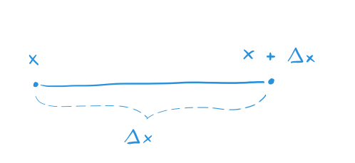

publicId=qknMVp_4s
id=5dba3d16f6db6d7638e0c647
publish=true
date=10/17/2019
---
# What does △x Mean?
## Reading "The Feynman Lectures on Physics"
## Volume 1, Chapter 9

The notation △x is read "delta x."

Strictly speaking, △x refers to a number like 7 or 10 so that △x = 7 or △x = 10. It is used to indicate a change from the value x; it reminds you that you started somewhere, at x, and then moved away, specifically, by △x units. For example, you can use it in the sentence, "Start at x and move △x units." The value you end up at is x + △x.

Here is a picture:

