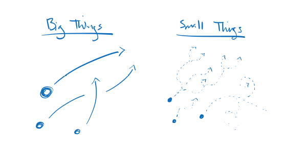

publish=true
date=11/19/2019
publicid=13hk546nk363bm3s
---
# Quantum Mechanics from 100,000 Feet
## Quantum Mechanics from Zero

Quantum Mechanics describes how subatomic things behave.

You can think about the world in terms of big things and small things. The big things include coffee cups, airplanes, and planets. The small things include electrons, photons, and things that are smaller than atoms: the subatomic things.

The big things are made out of matter and light like lego creations are made out of legos.

The small things are the matter and light. They are the legos.

Both move around in space and time, but they move around differently. The description of an electron moving from here to there is very different from the description of a bowling ball moving from here to there.

Quantum Mechanics tells you the description. It tells you how to describe how the small things - the subatomic things - move around in space and time. If you ask, "Hey, what's that electron going to do when such-and-such?" then you get your answer from Quantum Mechanics.

The thing to think about, then, is what questions can you ask about subatomic particles that Quantum Mechanics can tell you the answers to?
