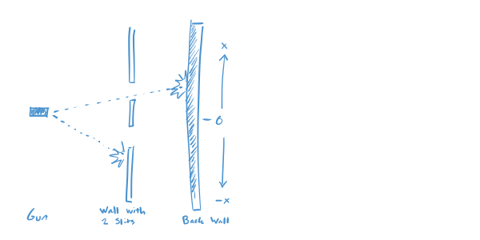
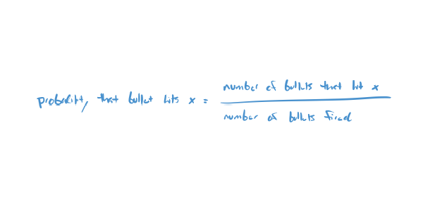

publish=true
date=11/21/2019
publicid=13hk5cgek38qjyme
---

# The Double Slit Experiment with Bullets: The Setup
## Quantum Mechanics from Zero

(This comes from Feynman's Explanation of the Double Slit Experiment).

Feynman asks us to consider the following experiment. You have three things: (1) A gun that shoots bullets, (2) a wall with two bullet sized slits in it, and (3) a wall that records where bullets hit it. And suppose that you set them up like this, looking down from above:

The gun fires sporadically, so sometimes the bullet goes through a slit and hits the back wall and sometimes it misses a slit and hits the middle wall.

Now for a question:

What is the probability that a bullet will hit a particular spot on the back wall?

The probability of hitting a spot is calculated by dividing the total number of bullets that hit the spot by the total number of bullets we fire:

