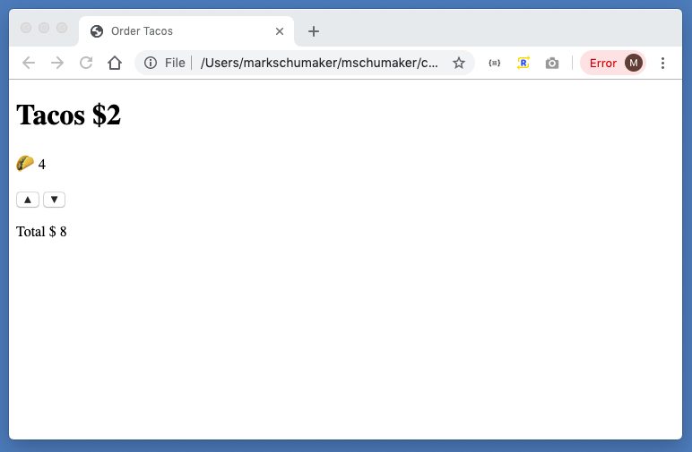

publish=true
date=9/12/2019
id=3vjlasc2k2knq0lb
---


# Why Do Frontend Frameworks Exist?

When I first got into web development, I didn't understand why frontend frameworks like React, Vue, and Angular existed. Here, I'm briefly going to explain why.

JavaScript frameworks solve a particular problem having to do with displaying data that changes. (Many of them solve additional problems, but I'm not going to talk about those).

Consider a web page that lets you order tacos. The web page shows the number of tacos that the user wants to order, has a button that adds a taco and a button that removes a taco, and shows the total cost of the order.



The main piece of data that this web page tracks is the number of tacos that the user wants to order. And when the user changes that number by pressing the buttons, the page needs to display the correct number of tacos and the correct total price. For example, when the user presses the "add taco" button, the number of tacos that the page displays needs to increase by 1.

In web-development-speak, the data that the app tracks is called the <em>state</em> of the app. In this case, the state of the app is the number of tacos that the user wants to order.

The main problem that frontend JavaScript frameworks try to solve is this: when the state changes, update every part of the web page - the HTML - that displays the data. In the case of our taco order app, we can do this with the following code:

```html
<!DOCTYPE html>
<html>
<head>
    <meta charset="utf-8">
    <title>Order Tacos</title>
</head>
<body>
    <h1>Tacos $2</h1>
    <div>
        <span>🌮 </span> <span id="taco-quantity"></span>
    </div>
    <br>
    <div>
        <button id="add">▲</button>
        <button id="remove">▼</button>
    </div>
    <br>
    <div>
        <span>Total $</span>
        <span id="total-price"></span>
    </div>
    <script type="text/javascript">


        // state i.e. the data that the app tracks
        let numberOfTacos = 0;

        let addButton = document.querySelector('#add');
        let removeButton = document.querySelector('#remove');
        let tacoQuantityDisplay = document.querySelector('#taco-quantity');
        let priceDisplay = document.querySelector('#total-price');

        let showNumberOfTacos = () => {
            tacoQuantityDisplay.textContent = numberOfTacos;
        }

        let showTotalPrice = () => {
            priceDisplay.textContent = numberOfTacos * 2;
        }

        addButton.addEventListener('click', () => {
            // update the state when the user clicks up
            numberOfTacos += 1;
            // show the results of the state change
            showNumberOfTacos();
            showTotalPrice();
        });

        removeButton.addEventListener('click', () => {
            // update the state when the user clicks up
            numberOfTacos -= 1;
            // show the results of the state change
            showNumberOfTacos();
            showTotalPrice();
        });

        // display state on initial page load
        showNumberOfTacos();
        showTotalPrice();

    </script>
</body>
</html>

```
In this case, a change in state - a change in `numberOfTacos` - means that we need to update the `#taco-quantity` element and the `#total-price` element.

So why use a framework?

When the state gets big and complicated and there are a lot of places that need
to get updated when the state changes, then the kind of code used above can
become hard to read and hard to change.

In short, the purpose of frameworks is to make development easier by automatically
handling updates on state change. Instead of explicitly telling the app which
parts to update like we do with `showNumberOfTacos()` and `showTotalPrice()` above,
frameworks handle those updates so that the developer doesn't need to.
