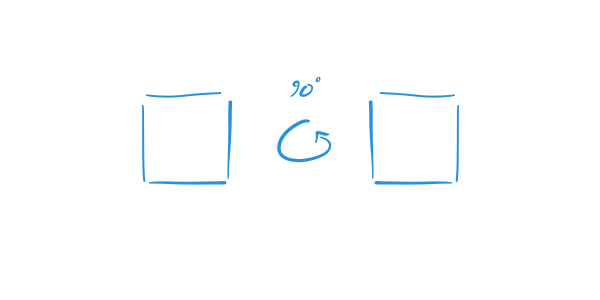

publish=true
date=11/4/2019
publicid=3vjlaxssk2o4eru2
tags=physics
---
# How Are Physical Laws Symmetric?
## Reading "The Feynman Lectures on Physics"
## Volume 1, Chapter 11, Section 1

In what sense is a physical law symmetric?

This is the main question that chapter 11 is intended to answer, but Feynman's introductory remarks give you something to think about.

First, Feynman uses Hermann Weyl's definition of symmetry:

> A thing is symmetrical if one can subject it to a certain operation and it appears exactly the same after the operation.

For example, a colorless square is symmetric with respect to the operation of a 90 degree rotation.

On the other hand, a square with horizontal lines is not. The square before the rotation and the square after look different.

It's important to recognize that symmetry is a property that is relative to a particular operation. The squares aren't symmetric or not in general, they're symmetric with respect to particular rotations. The square with horizontal lines, for example, is not symmetric with respect to a 90 degree rotation but it is symmetric with respect to a 180 degree rotation.

Based on this definition of symmetry, a physical law is symmetric when it is the same before and after some operation. That leaves you with two questions. First, what is the operation? And second, what do you mean by "the same physical law"?

The operation that Feynman seems interested in is change of location. A physical law is symmetric with respect to a change in location as long as holds here, there, and over there.

By "the physical law is the same," Feynman seems to mean that particular physical phenomena acting in accordance to the physical law occur the same way no matter where they occur. If a ball drops the same way here as it does over there, then the laws of dropping balls is symmetric with respect to change of location.
