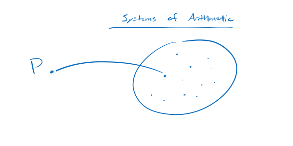

publish=true
date=11/18/2019
publicid=13hk5169k34p8spb
---
# One System of Arithmetic or All Systems?
## Notes on Godel's Incompleteness Theorem

In his Incompleteness Theorem, Kurt Godel proves that a particular system of arithmetic called P is undecidable.

Some explanations of the Incompleteness Theorem, however, say that the theorem shows that all systems of arithmetic are undecidable. For example, the Wikipedia article on it says the theorem shows "...the inherent limitations of every formal axiomatic system capable of modeling basic arithmetic."

I'm not sure how to square this; how does the undecidability of P show the undecidability of *every* other arithmetic system?

I'm sure Godel mentions something in the article, but here's a guess. The undecidability of P does not explicitly demonstrate the undecidability of every arithmetic system. *But*, the methods of proof are clear enough to apply to other systems. And that's enough to have confidence in the undecidability of all systems.
